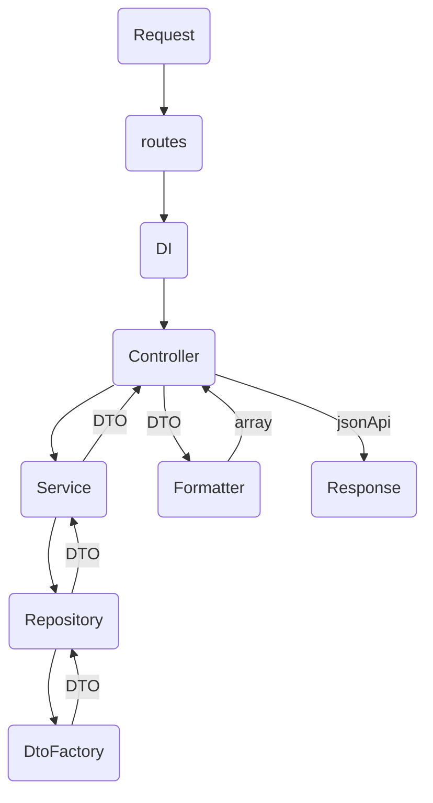

# apiSymfonyForBitrix

Скелет API на Symfony для использования с Bitrix

## Настройка окружения

### 0. Предустановки

На локальном компьютере установлены:
- PhpStorm
- git
- composer

В домашней директории в папке .ssh лежат файлы:
- id_rsa — приватный ключ
- id_rsa.pub — публичная часть ключа

Настроен проброс ключей (AgentForward).


### 1. Настраиваем git
Указываем текущего пользователя и добавляем alias для упрощения работы с git
```bash
$ git config --global user.name "Фамилия Имя"
$ git config --global user.email "email@email.email"
$ git config --global color.ui true
$ git config --global alias.st status
$ git config --global alias.co checkout
$ git config --global alias.br branch
$ git config --global alias.hist log --pretty=format:\"%h %ad | %s %d [%an]\" --graph --date=short
$ git config --global alias.glog log --graph --all --decorate
```

### 2. Развертывание локального репозитория

Заходим в папку с проектами в bash / cmd. В ней клонируем центральный репозиторий
```bash
$ git clone git@github.com:TheRakot/apiSymfonyForBitrix.git
```
Или более подробно
```bash
$ git init
$ git remote add origin git@github.com:TheRakot/apiSymfonyForBitrix.git
$ git fetch
$ git pull origin master
```

Обновляем зависимости через composer
```bash
$ composer install
```

Локальный репозиторий готов. В нем уже можно что-то кодить и отправлять в центральный репозиторий.


### 3. Автозагрузка классов в DI

При добавлении нового кода нужно использовать DI.
В качестве DI-контейнера на проекте используется компонент Symfony.
Файл с настройками - /local/php_interface/services.yml.

## Работа с API

### 1. Роутинг
Для каждой сущности создается отдельный файл по адресу /api/v1/routes/.  <br/>
Структура

```php
$routes->add(
	'apiV1.example', #Название должны отличаться между собой
	new Route('/api/v1/example/', #путь к end-point
		[
			'_controller' => Api\Controllers\Example::class, #класс контроллера
			'_method' => 'exampleApi', #метод в контроллере
			#'_authorization' => true #не используется
		],
		[], [], '', [], 'GET' #тип запроса
	)
);
```

### 2. Конфигурация DI
Для использования метода из контроллера, в конфигурацию DI должна быть внесена соответствующая yml запись
```yaml
  #Logger для ApiV1
  Psr\Log\LoggerInterfaceApiV1:
    factory: ['Classes\Logs\router', 'getApiV1']
  #Пример контроллера для ApiV1
  Api\Controllers\Example:
  #Новости
  Api\Controllers\News:
    arguments:
      $service: '@Classes\News\ServiceNews\Service'
      $formatter: '@Classes\News\FormatterNews\Formatter'
  Classes\News\ServiceNews\Service:
    arguments:
      $repository: '@Classes\News\RepositoryNews\Repository'
  Classes\News\FormatterNews\Formatter:
  Classes\News\RepositoryNews\Repository:
```

### 3. Схема работы


### 3. Контроллер
Содержит основной код:
- Получение параметров из запроса
- Обращение к сервисам
- Вывод ответа через форматер

```php
$limit = (int)$request->query->get('limit') === 0 ? 3 : (int)$request->query->get('limit');
$page = (int)$request->query->get('page') === 0 ? 1 : (int)$request->query->get('page');
$arNews = $this->service->getNewsList($limit, $page);
$arResult = $this->formatter->arrayDtoNewsItemToApiResponse($arNews);
```

### 4. Сервис
Служит для получения сырых данных, не знает как они будут использоваться

```php
public function getNewsList(int $limit = 3, int $page = 1): array
{
    return $this->repository->getNewsList($limit, $page);
}
```

### 5. Репозиторий
Получает данные из конкретной системы, в нашем случае Bitrix. Выполняются все необходимые выборки <br>
На выходе возвращает DTO (DataTransferObject)